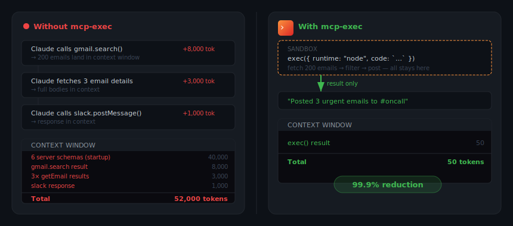
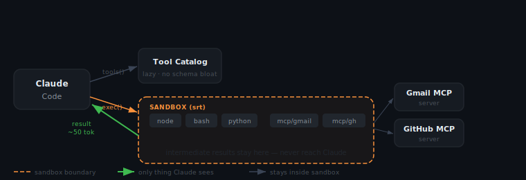
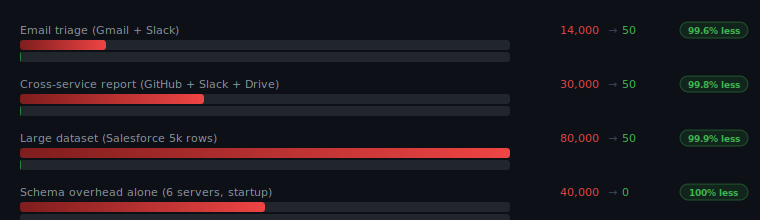

<picture>
  <source media="(prefers-color-scheme: dark)" srcset="assets/logo-dark.svg">
  
</picture>

[](https://www.npmjs.com/package/mcp-exec)
[](https://nodejs.org)
[](#requirements)
[](LICENSE)
[](https://claude.ai/code)

> **Implementation of** ["Code execution with MCP: building more efficient AI agents"](https://www.anthropic.com/engineering/code-execution-with-mcp) — Anthropic Engineering, Nov 2025. The canonical reference for this pattern.


[Install →](#installation) &nbsp;&nbsp; [How it works →](#how-it-works)

---

## 52,000 tokens → 50 tokens.

This isn't a compression trick. Intermediate data — raw API responses, filtered lists, full document bodies — never enters the context window at all. The sandbox is opaque to Claude by design.

---

## You've been here.

Mid-workflow. Claude's working. Three more tool calls to go. Then:

```text
✓ Searching QuickBooks... 847 invoices found (context: +14,200 tokens)
✓ Filtering overdue... 23 invoices (context: +8,100 tokens)
✓ Fetching customer details...

⚠  Claude AI Usage Limit Reached
   You've reached your usage limit and will be able to resume in 5 hours.
```

The tool calls worked. Claude ran out of room to think.

mcp-exec fixes this architecturally — intermediate data never touches context.

---

## Before / After



---

## How it works

mcp-exec adds two tools to Claude Code:

- **`tools(query)`** — searches your connected MCP servers and returns trimmed summaries. Full schemas never touch the context window.
- **`exec(code, runtime)`** — runs code in an OS-level sandbox. MCP servers are importable as modules. Only the final return value comes back.



**Runtimes:**

| Runtime | State | Use for |
|---------|-------|---------|
| `"node"` | Persistent (`globalThis`) | MCP orchestration, multi-step workflows |
| `"bash"` | Stateless | Unix pipelines, `jq`, `awk`, post-processing |
| `"python"` | Stateless (`uv run --isolated`) | Data analysis, pandas, arbitrary PyPI packages via PEP 723 |

---

## Token savings



---
