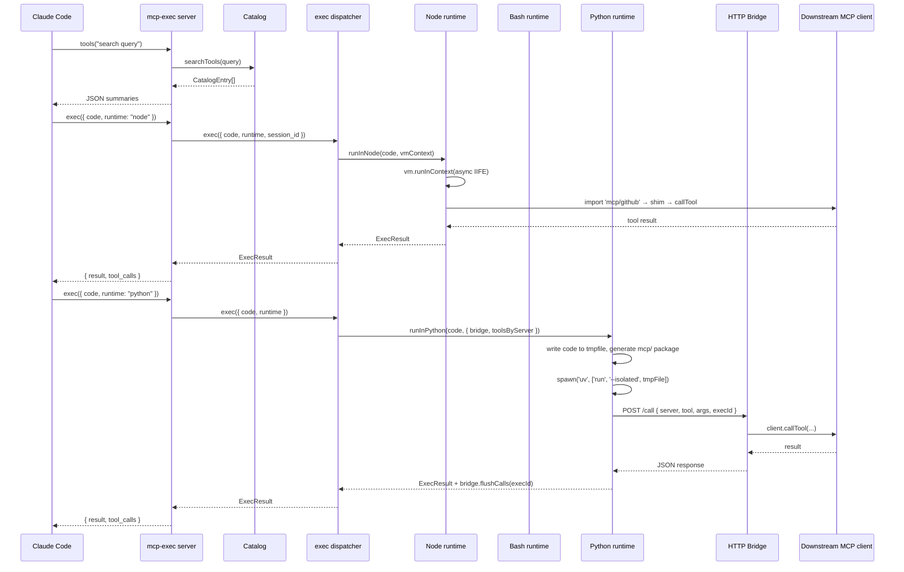

# Architecture

## System Overview

mcp-exec is an MCP server that proxies downstream MCP servers through a sandboxed execution layer. It exposes two tools to Claude Code: `tools` (catalog search) and `exec` (sandboxed code execution). Downstream MCP tool invocations happen inside the sandbox — invisible to Claude Code's tool-use event system. From CC's perspective, only one tool was called: `exec`.

### Startup Sequence

When the mcp-exec server starts, it executes the following steps in order:

1. **Sandbox init** — reads the `sandbox` block from `~/.claude/settings.json` (user-scope) and `.claude/settings.json` (project-scope), merges them, and calls `SandboxManager.initialize()` from `@anthropic-ai/sandbox-runtime`. This applies the OS-level sandbox to the entire server process. Fatal if it fails.
2. **MCP client connect** — reads `.claude/mcp.json`, filters out the `mcp-exec` entry itself, and calls `connectMcpClients()` on all remaining server names. Uses `Promise.allSettled` so failed servers become `unavailable` entries rather than crashing startup.
3. **Catalog build** — calls `buildCatalog()` which runs `Promise.allSettled` on each connected client's `listTools()`. Derives one-line signatures from `inputSchema`. Failed listings join the unavailable list. The catalog holds trimmed summaries only — full JSON schemas are never loaded.
4. **Loader hook register** — calls `register('./loader/hooks.js', { data: { toolsByServer, unavailableServers } })`. This makes Node's ESM loader intercept `import 'mcp/server-name'` specifiers in user code and return generated virtual modules. Must happen before any `exec` calls.
5. **Bridge start** — starts an HTTP server on `127.0.0.1:{random-port}` that proxies MCP tool calls from Python subprocesses back to the real MCP SDK clients. Records `ToolCallRecord` entries per `execId` for later retrieval.
6. **MCP server start** — creates the MCP `Server` instance, registers `ListTools` and `CallTool` handlers, connects the `StdioServerTransport`, and begins listening.

## Data Flow Diagram



## Component Map

| File | Role |
|---|---|
| `src/server.ts` | MCP server entry. Runs the startup sequence. Registers `tools` and `exec` tool handlers. Connects `StdioServerTransport`. |
| `src/types.ts` | Shared types: `ToolSummary`, `UnavailableServer`, `CatalogEntry`, `ToolCallRecord`, `ExecResult`, `RuntimeParam`. |
| `src/catalog/builder.ts` | `buildCatalog()` — `Promise.allSettled` over all clients' `listTools()`. Derives signatures. Returns tools + unavailable list. |
| `src/catalog/index.ts` | `searchTools(query)` — tokenizes query, splits camelCase tool names, filters stop words, returns all matching `CatalogEntry` entries. `"*"` returns everything. |
| `src/sandbox/config.ts` | `resolveSandboxConfig()` — reads `sandbox` block from user and project settings.json, merges arrays (union dedup), applies `DEFAULT_ENV_ALLOW` fallback. |
| `src/sandbox/session.ts` | `SessionManager` — creates and caches `vm.Context` objects. 100-session max. 10-minute idle timeout (reset on each access). |
| `src/sandbox/index.ts` | `createExecDispatcher()` — routes by runtime type. Wraps SDK clients to the two-arg duck-type interface expected by shims. |
| `src/sandbox/runtimes/node.ts` | `runInNode()` — wraps code in async IIFE, runs via `vm.runInContext`. Captures `console.log/info/dir` → stdout, `console.warn/error/debug` → stderr. Bridges `__mcpClients` to `globalThis` for shim access. |
| `src/sandbox/runtimes/bash.ts` | `runInBash()` — `spawn('bash', ['-c', code])` with filtered env. SIGTERM on timeout (exit code 124). Stateless. |
| `src/sandbox/runtimes/python.ts` | `runInPython()` — writes code to tmpfile, generates `mcp/` package in tmpdir, `spawn('uv', ['run', '--isolated', tmpFile])`. Flushes `tool_calls` from bridge after completion. Cleans up tmpfile and package dir. |
| `src/bridge/server.ts` | HTTP server on `127.0.0.1:{random-port}/call`. POST JSON `{ server, tool, args, execId }`. Forwards to real MCP client. Records `ToolCallRecord` per `execId`. `flushCalls(execId)` returns and clears the log. |
| `src/loader/hooks.ts` | ESM loader hooks. `resolve()` intercepts `mcp/server-name` specifiers → `virtual:mcp/server-name`. `load()` returns generated shim source or unavailable stub. |
| `src/mcp-clients/index.ts` | `connectMcpClients()` — reads `.claude/mcp.json`, `Promise.allSettled` connects all servers, returns `{ clients, unavailable }`. |

## exec() Data Flow

From a Claude tool call to a returned result:

```
CC calls exec({ code, runtime: "node", session_id?: "..." })
  │
  ▼
server.ts CallToolRequestSchema handler
  → args.code, args.runtime, args.session_id extracted
  → exec(opts) called
  │
  ▼
sandbox/index.ts createExecDispatcher()
  → typeof runtime === 'string' ? type = runtime : type = runtime.type
  → timeout, env extracted from config object if present
  │
  ├─[node]──▶ sessions.getOrCreate(session_id, shimClients)
  │            → vm.Context retrieved or created
  │            → runInNode(code, context, { timeout })
  │              → wrapCode: "(async () => { <code> })()"
  │              → vm.runInContext(..., { importModuleDynamically: USE_MAIN_CONTEXT_DEFAULT_LOADER })
  │              → return value → result field
  │
  ├─[bash]──▶ runInBash(code, { timeout, env, allowedEnv })
  │            → spawn('bash', ['-c', code])
  │            → stdout → result field
  │
  └─[python]▶ runInPython(code, { timeout, env, allowedEnv, bridge, toolsByServer })
               → write code to /tmp/mcp-exec-<uuid>.py
               → generateMcpPackage() → mcp/ dir in tmpdir
               → spawn('uv', ['run', '--isolated', tmpFile])
               → stdout → result field
               → bridge.flushCalls(execId) → tool_calls
  │
  ▼
ExecResult { result, stdout, stderr, exitCode, tool_calls }
  │
  ▼
server.ts serializes to JSON:
  { result, tool_calls, ...(exitCode !== 0 && { stderr, exitCode }) }
  → returned to CC as MCP text content
```

## MCP Import Mechanism

Node runtime user code can call MCP tools using native ESM imports:

```typescript
import { searchEmails } from 'mcp/gmail';
const results = await searchEmails({ query: 'from:boss' });
```

The import path `mcp/server-name` is intercepted by the ESM loader hooks registered at startup:

1. **`resolve()` hook** — checks if the specifier starts with `mcp/`. If yes, returns `virtual:mcp/server-name` as the URL and short-circuits Node's real resolution. All other specifiers fall through to the standard loader.
2. **`load()` hook** — checks if the URL starts with `virtual:mcp/`. If yes:
   - If the server is in `unavailableServers`, returns a stub module that throws a descriptive error on any function call.
   - If the server is in `toolsByServer`, returns generated source code: one named export per tool, each wrapping a `globalThis.__mcpClients[serverName].callTool(name, args)` call.
   - If neither, throws `No source for server: '...'`.
3. **`__mcpClients` bridging** — shim functions call through `globalThis.__mcpClients`. The Node runtime (`runInNode`) temporarily sets `globalThis.__mcpClients` to the current vm.Context's client map before running user code, and restores the previous value in `finally`. This handles the fact that shim modules run in the main context (not the vm.Context) because of `USE_MAIN_CONTEXT_DEFAULT_LOADER`.

Python runtime user code uses generated `mcp/` packages on `PYTHONPATH` instead, which make HTTP calls to the bridge rather than using ESM.

## Session Model

The `SessionManager` maintains `vm.Context` objects that persist across `exec` calls within a conversation.

**Implicit session** — when no `session_id` is provided, the context key `__implicit__` is used. All exec calls in the same conversation share this context automatically. `globalThis.*` state (variables, imported module instances) persists between calls.

**Explicit session** — pass a `session_id` string to isolate parallel workflows that must not share `globalThis` state. Useful when running two concurrent agentic tasks in the same conversation.

**Lifecycle:**
- A new `vm.Context` is created with `SAFE_NODE_GLOBALS` and `__mcpClients` injected.
- Each access resets the 10-minute idle expiry timer.
- Sessions are evicted on idle timeout or at `SessionManager.cleanup()` (on SIGINT).
- Hard cap: 100 concurrent sessions. Exceeding this throws immediately.

**SAFE_NODE_GLOBALS allowlist** — the vm.Context includes these globals and nothing else from Node's runtime:

`Buffer`, `URL`, `URLSearchParams`, `TextEncoder`, `TextDecoder`, `structuredClone`, `queueMicrotask`, `atob`, `btoa`, `AbortController`, `AbortSignal`, `setTimeout`, `clearTimeout`, `setInterval`, `clearInterval`, `setImmediate`, `clearImmediate`

Deliberately excluded: `process`, `require`, and all internal module machinery. User code cannot access the filesystem, spawn processes, or read environment variables through the vm.Context directly.

**Bash and Python are stateless** — each `exec` call spawns a fresh subprocess. There is no session concept for these runtimes. Cross-call state must be passed explicitly via stdout → stdin or written to an allowed filesystem path.

## Sandbox Layering

mcp-exec applies two independent, additive sandbox layers:

```
┌─────────────────────────────────────────────────────┐
│  srt OS sandbox (SandboxManager.initialize)         │
│  Applied to the entire mcp-exec server process      │
│  Controlled by: settings.json sandbox block         │
│                                                     │
│  ┌───────────────────────────────────────────────┐  │
│  │  vm.Context (Node runtime only)               │  │
│  │  JavaScript isolation inside the Node call    │  │
│  │  No process, no require, SAFE_NODE_GLOBALS    │  │
│  └───────────────────────────────────────────────┘  │
│                                                     │
│  Bash/Python: OS process boundary only              │
│  (no vm.Context; isolated by filtered env + spawn)  │
└─────────────────────────────────────────────────────┘
```

The **outer layer** (`srt` / `@anthropic-ai/sandbox-runtime`) applies OS-level enforcement (macOS Seatbelt or Linux seccomp/namespace depending on platform) to the mcp-exec server process itself. This controls network access (`allowedDomains`), filesystem writes (`allowWrite`, `denyWrite`), and environment variables (`env.allow`). It is configured once at startup and cannot be changed per-call.

The **inner layer** (`vm.Context`) applies only to the Node runtime. It restricts what JavaScript APIs are available inside user code. A Node exec call cannot escape the vm.Context to access Node's process object or filesystem APIs — it can only use the injected SAFE_NODE_GLOBALS and MCP shims.

Bash and Python get OS-process isolation via `spawn` with a filtered environment. They are not wrapped in a vm.Context, but they are still subject to the outer srt sandbox.

## Bridge: Python MCP Calls

Python does not have access to Node's ESM loader hooks or the in-process MCP SDK clients. Instead, mcp-exec generates an `mcp/` Python package and injects it via `PYTHONPATH`:

```
Python user code:
  from mcp.github import list_pull_requests

Generated mcp/github/__init__.py:
  def list_pull_requests(**kwargs):
      import urllib.request, json
      payload = json.dumps({
          "server": "github",
          "tool": "list_pull_requests",
          "args": kwargs,
          "execId": "<uuid>"
      }).encode()
      req = urllib.request.Request(
          "http://127.0.0.1:<port>/call",
          data=payload,
          headers={"Content-Type": "application/json"},
          method="POST"
      )
      with urllib.request.urlopen(req) as resp:
          return json.loads(resp.read())["result"]
```

The HTTP bridge (`BridgeServer`) receives the POST, looks up the server name in its client map, calls `client.callTool({ name, arguments })` on the real MCP SDK client, and returns the result. It also records a `ToolCallRecord` under the `execId` so `flushCalls(execId)` can return it after the Python subprocess exits.

The generated package is written to a unique tmpdir and deleted after the subprocess completes, regardless of success or failure.
